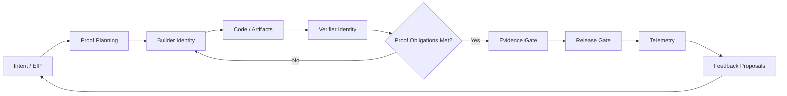
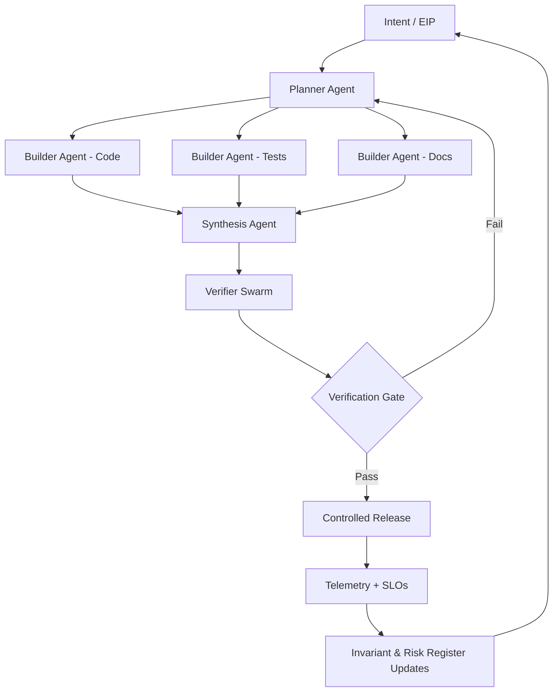
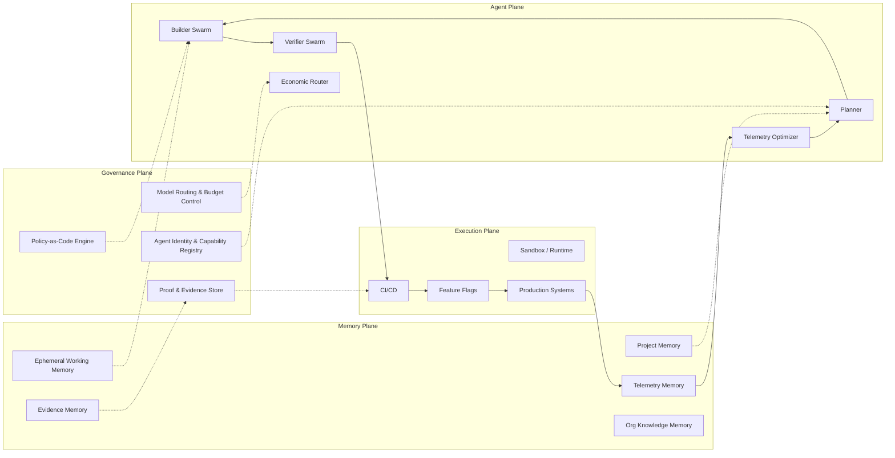

Verified Agentic Development (VAD)
Reference Architecture - Maturity Model View

For the full maturity model narrative, see [maturity_model.md](maturity_model.md).

Implementation status: this repository contains a Level 2 reference implementation plus an offline Level 3 demonstrator. Level 3 production-scale distributed orchestration and Level 4 enterprise control-plane diagrams remain architectural direction, not completed product claims.

## Level 1-2: Structured And Bounded Agentic Development

Implemented Level 2 reference characteristics:

- human-defined or ask-derived EIPs;
- proof mapping from EIP obligations;
- guarded verifier execution;
- builder/verifier separation for approval decisions;
- typed evidence with MEES and token governance;
- release gates with telemetry requirements;
- feedback proposals from failures, policy denials, and release outcomes;
- MCP tools and local A2A policy checks.

This stage introduces control loops, but autonomy remains bounded and local.

## Level 3: Multi-Agent Verified Orchestration

Implemented local demonstrator characteristics:

- `examples/level3-demo` fixture with arbitrary repo, ask, EIP, proof plan, fake provider route, fake deployment target, success evidence, failure evidence, and dashboard seed data;
- `vad swarm run --fixture ... --workdir ...` for a local planner/builder/verifier/auditor task graph over a copied fixture repo;
- `vad deploy demo` for fake deployment apply, telemetry pass, and local HMAC deployment attestation verification;
- `vad deploy failure-demo` for deterministic telemetry failure, fake rollback, feedback proposal, failed run evidence, and dashboard state;
- `vad ui serve --seed-level3-demo` and `docker compose up vad-ui` for local UI/API inspection of success, failure, approvals, work items, and coding-client attribution.

Still directional beyond this repository:

- planner agent decomposition;
- specialized builder agents;
- synthesis agent output merging;
- verifier swarm for security, property, and performance proof;
- risk-tiered release gating across services;
- economic routing across real provider backends.

The repository demonstrates Level 3 concepts locally. It does not provide production distributed orchestration, live cloud deployment, or default live model-provider calls.

## Level 4: Enterprise Agentic Operating System (Directional)

At this level, VAD becomes an enterprise control plane with unified policy, budget, identity, memory, evidence, telemetry, and production release governance. That is future work beyond this v0.1 reference implementation.
