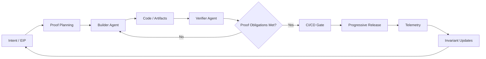
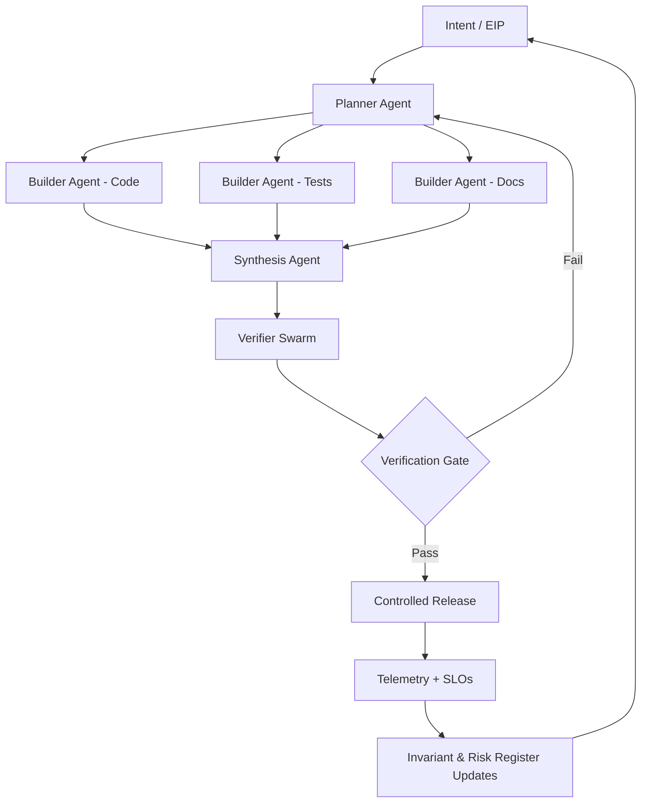
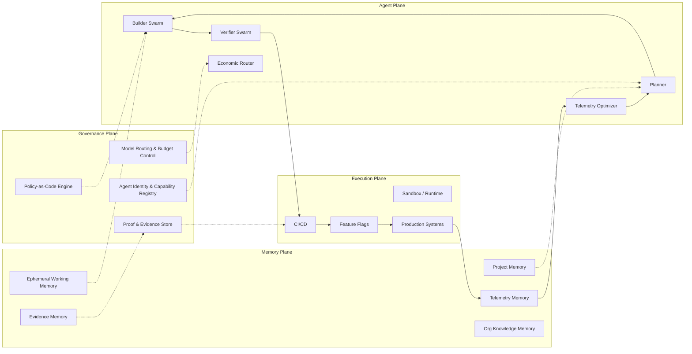

Verified Agentic Development (VAD)
Reference Architecture — Maturity Model View
> For the full maturity model narrative, see [maturity_model.md](maturity_model.md).
Level 1–2: Structured + Bounded Agentic Development

Characteristics

Human-defined EIP (Executable Intent Package)
Builder agent constrained by proof plan
Independent verifier agent
Progressive release with telemetry feedback
Single memory scope (project-level)
Limited model routing
This stage introduces control loops but autonomy remains bounded.

Level 3: Multi-Agent Verified Orchestration

Additions at this Level

Planner agent decomposes work
Specialized builder agents
Synthesis agent merges outputs
Verifier swarm (security, property, performance)
Risk-tiered release gating
Economic routing layer (model tiering)
Autonomy increases — but governance hardens.    

Level 4: Enterprise Agentic Operating System

Architectural Layers Explained
1. Governance Plane

The control layer.
Policy-as-Code enforcement
Model routing and cost ceilings
Agent capability registry
Cryptographic proof bundles
Risk-tier classification

Nothing executes outside this envelope.

2. Memory Plane

Stratified memory model.
Working memory (session scoped)
Project memory (architectural context)
Evidence memory (proof + attestations)
Telemetry memory (runtime feedback)
Organizational knowledge memory

All memory access is mediated and logged.

3. Agent Plane

Specialized autonomous components.
Planner (intent decomposition)
Builder swarm (implementation)
Verifier swarm (adversarial + invariant testing)
Economic router (model + token governance)
Telemetry optimizer (post-release learning)

Separation of duties prevents self-approval bias.

4. Execution Plane

Where code meets reality.
Sandboxed runtime
CI/CD verification gates
Progressive release
Production systems

Telemetry closes the loop.

Maturity Progression (Condensed View)

At low maturity:
AI accelerates output.

At high maturity:
AI operates inside a governed control system.

The transformation is not about automation.

It’s about shifting from:
Feature throughput
to:
Stable, verified, adaptive system evolution.