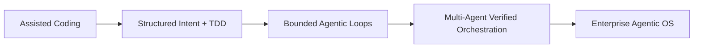

# VAD Maturity Model

## Repository Status

This repository currently implements a Level 2 reference slice plus an offline Level 3 demonstrator: structured EIPs, ask assessment, proof mapping, guarded execution, a bounded local loop, durable evidence, MEES/token governance, release gates, feedback proposals, MCP tools, local A2A policy checks, local swarm execution, fake-provider deployment, local signing, rollback feedback, and a Docker-served UI/API dashboard.

Level 3 is implemented only as deterministic local fixture-backed behavior. It does not provide production distributed swarms, live cloud deployment automation, default live model-provider calls, or enterprise identity/approval infrastructure. Level 4 remains a target architecture; this repository is not an enterprise-hosted control plane.
*From Assisted Coding → Verified Agentic Operating System*

The adoption of agentic development is not binary. Enterprises evolve through structured maturity stages. Each stage represents a change in control surface, verification depth, interoperability, and governance posture.

---

## Level 0 — Assisted Coding (Tooling Phase)

### Profile

- IDE copilots
- Prompt-driven code generation
- Human review as primary safety net

### Characteristics

- No structured intent artifact
- No executable proof obligations
- Limited governance linkage
- Token spend unmanaged

### Risk Posture

- High velocity, high fragility
- Spec drift and test myopia persist
- Technical debt accumulation accelerates

> This is the dominant industry state in 2024–2025.

---

## Level 1 — Structured Intent + TDD Overlay

### Profile

- Intent captured before code
- Proof obligations defined upfront
- Agents used under human supervision

### Characteristics

- EIPs (Executable Intent Packages) introduced
- **Verified-Agentic-Development**
- Acceptance + property tests required
- Basic CI gating
- No autonomous multi-agent orchestration

### Risk Posture

- Reduced regression risk
- Still human bottlenecked
- Governance largely manual

---

## Level 2 — Bounded Agentic Construction

### Profile

- Agents allowed to iterate in controlled loops
- Policy-as-code enforced
- Economic controls introduced

### Characteristics

- Separation of Builder and Verifier agents
- CI-integrated adversarial testing
- Token budgets and model routing enforced
- Sandbox + capability restrictions active

> This stage integrates lessons from the 2026 ecosystem realities

**Tool invocation risks**

- Prompt injection exposure
- Quadratic token cost growth

### Risk Posture

- Controlled autonomy
- Measurable economic governance
- Security posture begins to harden

---

## Level 3 — Multi-Agent Verified Orchestration

Status in this repository: local demonstrator implemented. `examples/level3-demo`, `vad swarm run --fixture`, `vad deploy demo`, `vad deploy failure-demo`, `vad ui serve --seed-level3-demo`, and `docker compose up vad-ui` demonstrate a fixture-backed swarm, fake provider route, fake deployment, signed attestation, rollback feedback, and dashboard inspection without live credentials or cloud services. Production distributed orchestration, synthesis across independent agent worktrees, and live provider fleet routing remain future work.

### Profile

- Specialized agent swarms coordinated via protocol
- Explicit decomposition and synthesis layers
- Aligned with A2A/MCP interoperability patterns

### Characteristics

- Planner agent (intent decomposition)
- Builder agents (domain-specific execution)
- Verifier agents (security, property, regression)
- Economic router agent
- Evidence generator agent

**New Capabilities**

- Cross-agent context boundary enforcement
- Agent Cards (identity + capability manifests)
- Zero-trust delegation between agents
- Traceability across orchestration layers

### Risk Posture

- Autonomous subsystems
- Hard verification gates
- Governance-by-evidence

---

## Level 4 — Enterprise Control Plane (Verified Agentic OS)

Status in this repository: directional. The reference implementation emits local evidence and policy decisions, but it is not an enterprise-hosted command center.

### Profile

- Centralized Agentic Command Center
- Policy, budget, identity, and memory all unified
- Continuous telemetry‑driven invariant refinement

> This reflects the “Agent Operating Model” projection from the 2026 research

### Extended Developer Landscape

### Characteristics

- Cross-repo agent fleet management
- Cryptographic proof-carrying PRs
- Governance artifacts auto-generated
- Risk-tier-based agent autonomy
- Continuous evaluation pipelines

### Outcome

Software becomes:

> A continuously verified operating system of business intent

---

## Extensible Architecture for Multi-Memory and Multi-Model Backends

VAD assumes heterogeneity:

- Multiple upstream memory modules
- Multiple LLM providers
- Multiple agent types
- Multiple execution environments

This section defines the extensibility hooks required to support that safely.

### Multi-Memory Architecture

Enterprise agentic systems require memory stratification.

#### Memory Types

1. **Ephemeral Working Memory**
   - Session-scoped
   - Builder/verifier loop context
   - Discarded or summarized post-run

2. **Project Memory**
   - AGENTS.md equivalent
   - Architectural decisions
   - Domain invariants
   - Persistent across tasks

3. **Evidence Memory**
   - Proof obligations
   - Signed attestations
   - Tool call traces
   - Audit bundles

4. **Telemetry Memory**
   - Production traces
   - Incident narratives
   - SLO drift history

5. **Organizational Knowledge Memory**
   - Coding standards
   - Security baselines
   - Risk tier definitions

### Memory Control Hooks

To prevent token bloat and drift, VAD introduces:

**Memory Access Contracts**

Every memory module must expose:

- Scope classification (public, project, restricted, secret)
- Token budget ceiling
- Redaction rules
- Version hash

**Memory Retrieval Gate**

Agents cannot pull memory directly. They must:

- Declare purpose
- Specify scope
- Receive bounded retrieval payload
- Log retrieval into evidence bundle

This prevents:

- Silent context expansion
- Prompt injection via memory
- Cross-project contamination

### Multi-Model Backend Orchestration

Enterprise systems increasingly mix:

- Fast reactive models
- Deep reasoning models
- Domain-tuned models
- On-prem models
- External API models

VAD requires Model Routing Governance.

#### Model Tiering Strategy

| Tier | Use Case                  | Constraints                          |
|------|---------------------------|--------------------------------------|
| 0    | Formatting / boilerplate  | Cheap, low-latency                   |
| 1    | Standard coding tasks     | Moderate reasoning                   |
| 2    | Architectural reasoning   | High token cap                       |
| 3    | Security / verification   | Deterministic bias                   |
| 4    | Regulated contexts        | On-prem / air-gapped                 |

##### Model Selection Hooks

Every agent invocation must log:

- Model ID
- Version
- Token count
- Cost
- Risk tier
- Justification

Proof obligations cannot pass unless:

- Model class is permitted for task type
- Cost within budget
- Determinism thresholds met (if required)

This prevents:

- Overuse of expensive models
- Silent provider drift
- Hidden risk-class violations

### Agent Identity and Capability Manifest

Each agent must publish an **Agent Card** (aligned conceptually with A2A but enterprise-bound).

Agent Card contains:

- Unique identity
- Capability set
- Max autonomy tier
- Allowed tool classes
- Allowed model tiers
- Required verifier oversight
- Memory scopes allowed

> No agent operates outside its declared envelope.

### Extensible Hook Framework

VAD extensibility occurs via five control hooks:

1. **Intent Ingress Hook**
   - Before work begins:
     - Validate EIP structure
     - Classify risk tier
     - Allocate model + budget envelope

2. **Memory Retrieval Hook**
   - All context pulls routed via:
     - Memory contract validation
     - Scope enforcement
     - Retrieval logging

3. **Tool Invocation Hook**
   - Intercept:
     - Shell
     - Git
     - Network
     - MCP servers
     - A2A calls
   - Enforce:
     - Capability policy
     - Escalation gating
     - Zero-trust boundaries

4. **Verification Hook**
   - Before merge:
     - Run invariant checks
     - Run property tests
     - Run adversarial fuzz
     - Run SLO regression checks
     - Validate proof bundle completeness

5. **Telemetry Feedback Hook**
   - Post-release:
     - Compare runtime metrics to predicted budgets
     - Detect invariant drift
     - Propose strengthened proof obligations

### Economic Governance Layer

Multi-model + multi-memory systems introduce runaway cost risks.

VAD introduces:

- **Thinking Budgets**
  - Allocated per EIP.
- **Loop Depth Caps**
  - Maximum autonomous iteration cycles.
- **Token Audit Trails**
  - Linked to proof bundles.
- **Cost-to-Outcome Ratio Metrics**
  - Tokens spent per:
    - Passing test
    - PR accepted
    - Incident avoided

If cost/benefit degrades:
- Agent autonomy tier automatically reduced.

### Safety Envelope for Multi-Agent Ecosystems

As agent ecosystems resemble microservices, VAD enforces:

- Zero-trust agent-to-agent communication
- Signed tool manifests
- Default-deny execution
- Context isolation
- Cross-agent proof aggregation

---

## The End-State: Enterprise Agentic OS

At full maturity:

- Memory is stratified and governed
- Model selection is policy-bound
- Agents are capability-scoped
- Every change is proof-carrying
- Governance artifacts are auto-generated
- Economic efficiency is measurable
- Telemetry strengthens invariants

Enterprise software stops being:

> Code that evolves unpredictably

and becomes:

> A controlled, verifiable, adaptive system of structured intent

### Maturity Progression (Condensed View)

